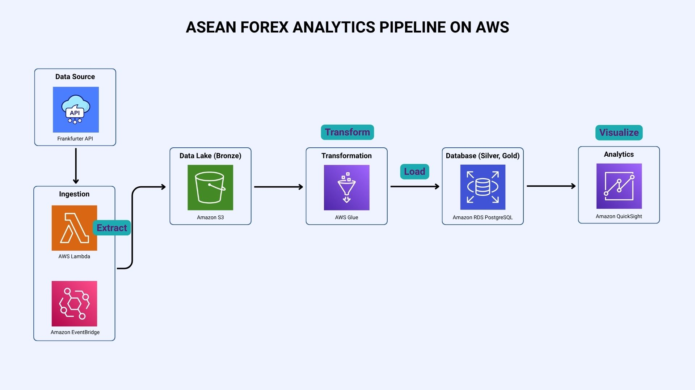

# ASEAN Exchange Rate Analytics
This project collects daily exchange rates for ASEAN currencies (using USD as the base currency), uses S3 as its landing zone, transforms and enriches with Glue, loads into RDS PostgreSQL for further enriching, and visualized via QuickSight.
, stores them in PostgreSQL via AWS RDS, and visualizes insights in Power BI. 

## Architecture

## Covered Currencies and Countries
The ETL pipeline tracks and analyzes the official legal tenders of member states:
- Brunei Darussalam — Brunei Dollar (BND)
- Cambodia — Cambodian Riel (KHR)
- Indonesia — Indonesian Rupiah (IDR)
- Laos — Lao Kip (LAK)
- Malaysia — Malaysian Ringgit (MYR)
- Myanmar — Myanmar Kyat (MMK)
- Philippines — Philippine Peso (PHP)
- Singapore — Singapore Dollar (SGD)
- Thailand — Thai Baht (THB)
- Vietnamese — Vietnamese Dong (VND)

## Features
- Automated daily ETL pipeline 
- SQL queries for business insights
- Interactive dashboard

