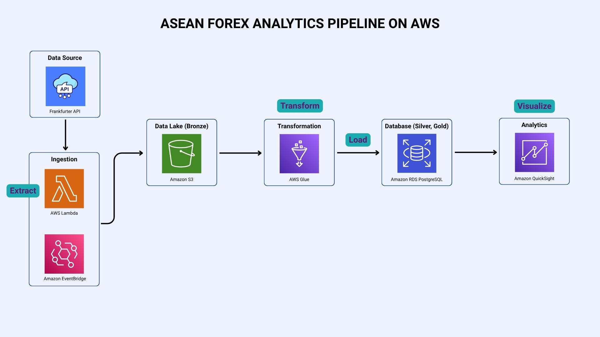

# ASEAN Exchange Rate Analytics
This project collects daily exchange rates for ASEAN currencies (using USD as the base currency), stores them in PostgreSQL via AWS RDS, and visualizes insights in Power BI. 

## Architecture
This project’s architecture follows an ETL pipeline design, where data is extracted via batch and daily ingestion processes, transformed through preprocessing logic, and loaded into an AWS RDS PostgreSQL database for visualization in Power BI.

## Covered Currencies and Countries
The ETL pipeline tracks and analyzes the official legal tenders of member states:
- Brunei Darussalam — Brunei Dollar (BND)
- Cambodia — Cambodian Riel (KHR)
- Indonesia — Indonesian Rupiah (IDR)
- Laos — Lao Kip (LAK)
- Malaysia — Malaysian Ringgit (MYR)
- Myanmar — Myanmar Kyat (MMK)
- Philippines — Philippine Peso (PHP)
- Singapore — Singapore Dollar (SGD)
- Thailand — Thai Baht (THB)
- Vietnamese — Vietnamese Dong (VND)

## Features
- Automated daily ETL pipeline 
- SQL queries for business insights
- Interactive Power BI dashboards

In addition to daily updates, the project will also backfill one year of historical exchange rate data. This allows deeper insights such as:
- Year-over-year comparisons
- Identifying long-term currency trends
- More robust volatility analysis

