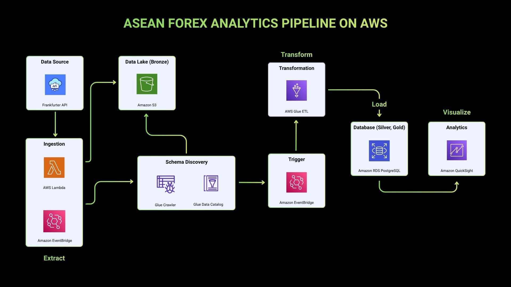

# ASEAN Exchange Rate Analytics
An end-to-end data pipeline that ingests daily USD-to-ASEAN-currency exchange rates (sourced from Frankfurter API), transforms and loads them into PostgreSQL, and surfaces them through interactive dashboards for currency trend analysis. Built entirely on AWS, the pipeline runs on a daily schedule. From raw API  ingestion through to analytics-ready visualizations, no manual intervention is required.

## Covered Currencies and Countries
The ETL pipeline tracks and analyzes the official legal tenders of ASEAN member states:
- Brunei Darussalam — Brunei Dollar (BND)
- Cambodia — Cambodian Riel (KHR)
- Indonesia — Indonesian Rupiah (IDR)
- Laos — Lao Kip (LAK)
- Malaysia — Malaysian Ringgit (MYR)
- Myanmar — Myanmar Kyat (MMK)
- Philippines — Philippine Peso (PHP)
- Singapore — Singapore Dollar (SGD)
- Thailand — Thai Baht (THB)
- Vietnam — Vietnamese Dong (VND)

## Architecture

## Other AWS Services Utilized
- **IAM** — scoped permissions for Lambda, Glue, and EventBridge
- **CloudWatch** — logging and debugging for Lambda and Glue job runs
- **VPC** — secured network access between Glue and the RDS PostgreSQL instance
- **Athena** — ad hoc querying of the S3 data lake during development and validation

